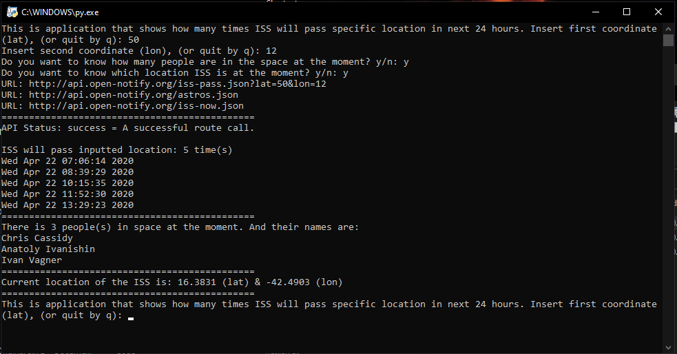

# ISS Spaceship tracking

This is one of my school projects, which point is to learn how to use rest APIs and keep track of ISS Spaceship. There is no GUI made for this application, but it's coming and in progress.
I will also upgrade the 'third_api', so it will give exact position including latitude, longitude and what country/city it's approximately. Also other ideas are welcome!

ISS Spaceship tracking:

* Is an application that tells how many times ISS Spaceship will pass given location in next 24 hours.
* Takes user input to modify url and will give more information if user wants to.
* Uses 3 open APIs to get information
* Is good example how to use URLLIB.PARSE and REQUESTS libraries to get json data.

## Usage

Simply download the source folder and the code is explained on the .py file.
Then you need to install some libraries wiht pyinstall:

## Pip install libraries
* Python 3 needs to be installed (You can download it from the official site of python.)
* Pip install urrlib.parse (import urllib.parse)
* Pip install requests (import requests)
* import datetime
* import time

## Visualization

## News

## Ghange log

## Authors
* Niclas Ekman
